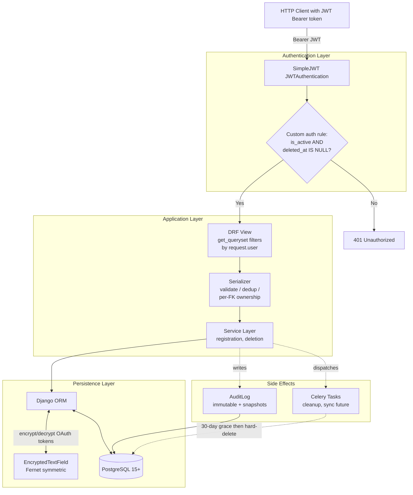

# Aurora

A multi-source athletic data hub with provider-aware deduplication and lactate-driven training analysis.


---

## Why Aurora exists

I've spent fifteen years on Kazakhstan's national short-track speed skating team, which means I've spent fifteen years using every fitness platform on the market. Whoop, Garmin, Polar, Strava, Apple Health, GymAware right now. Oura, Elite HRV, TrainingPeaks, FirstBeat Sport, Zones before that. Every one of them sees a slice of my training and recovery. None of them sees the whole picture, and most of them is so uncorrect.

Four pain points I've lived with:

**Data conflicts when devices overstep.** I wear Whoop 24/7 and a Garmin watch on training days. They overlap in two places. Sleep: both give me a sleep score every morning with different methodologies, and I have to pick whom to trust. Training: Garmin records the ride properly — power, pace, HR zones, cadence. Whoop on my wrist also "detects" the session and runs its own analysis with only wrist HR, no power, no pace. The result is two records of the same workout, one accurate and one half-broken, each app insisting its version is the truth. Strava sits downstream and uploads both, so the same ride shows up twice in my feed. There is no neutral referee to say "Garmin owns the workout, Whoop owns sleep — stop fighting over each other's territory."

**Heart rate lies, lactate doesn't.** A recent ride this season: 2 hours, 215W average power, in heavy heat. My heart rate sat at 167 bpm. Garmin Connect classified the session as threshold load — Zone 4. Whoop said roughly the same, around 2 hours in Zone 4, high cardiovascular stress. The lactate measurement I took during the ride read 1.7 mmol/L, which is squarely Zone 2: base aerobic work, recovery-friendly. Neither platform lets me input lactate, so neither could see that the elevated HR was driven by heat, not by intensity. The "training effect" both apps reported was wrong by an entire zone.

**Even at the elite level, the workflow is screenshots and paper notebooks.** In the lead-up to Milan 2026, my daily preparation looked like this. Wake up — screenshot my Whoop to the team doctor. Morning ice session in a Polar chest strap, coach watching live HR rink-side. Post-session: screenshot to coach plus a perceived-effort rating from 1 to 5. Evening cycling on a power-meter trainer with Garmin: another screenshot. Lactate measurements logged in my iPhone Notes while the coach wrote them by hand in a paper notebook. Three screenshots and one paper log per day, every day, for years. World-class coaches still rebuild a daily picture in Excel because no platform delivers it for them.

**AI advice without context is noise.** Generic "based on your last week" recommendations ignore the most important variable in periodized training: which phase the athlete is in. A 5-hour zone-2 ride in a base block means "good base work." The same ride in a taper week before a championship means "you just blew the race." Zero consumer platforms know the difference — and throwing a more expensive AI model at the same bad inputs doesn't fix this; it just hallucinates with more confidence.

Aurora is the backend I always wanted to exist for my health and fitness daily grind.

---

## Vision

Aurora is architected as a three-tier product, strategically designed to scale and cover the entire global fitness market—from casual trackers to professional sports organizations.

| Tier | Target Audience | Core Capabilities & Business Logic |
|---|---|---|
| **Aurora Free** *(Free forever)* | General public, fitness fans, and anyone tracking basic health/wellness across multiple wearables. | **The Foundation:** Unified dashboard for sleep, recovery, HR, and workouts. The core provider-priority engine works here to automatically resolve conflicts and eliminate duplicate entries across all connected devices globally. |
| **Aurora Plus** *(Low-cost subscription)* | Self-coached athletes, amateur racers, and serious data geeks (marathoners, cyclists, runners, triathletes, heavy lifters). | **Deep Performance Analytics:** Adds athlete-managed training-phase tagging (base, build, peak, taper) and lactate tracking. Users can log blood lactate directly into workout timelines to override and correct heat-distorted heart rate zones. Includes custom strength logs with RPE markers. |
| **Aurora Pro** *(Premium B2B subscription)* | Professional coaches, clubs, national teams, and sports organizations. | **The B2B Coach-Athlete Ecosystem:** Unlocks a dedicated team management dashboard and multi-user access grants. Features a "Traffic-Light" readiness engine (Red/Yellow/Green) calculated from aggregate athlete load. Fully integrates GymAware hardware to map velocity-based data across the entire roster. |

AI-driven training analysis (described below) is available across Plus and Pro tiers, fed by the clean-data pipeline that the Free tier already builds.

### AI Strategy: Clean Data In, Clean Insights Out

The current hype is all about burning money on the most expensive, state-of-the-art LLMs. Aurora takes the opposite approach: garbage in, confident garbage out.

An elite model fed with raw, contradicting heart rate streams from two different devices will just hallucinate with high confidence. The real issue with athletic AI insights isn't that the models are dumb — it's that their context is completely broken.

Aurora operates on a simple principle: give an ordinary, low-cost model the cleanest possible inputs, and it will outperform a premium model fed with raw data soup.

```
[Raw Wearable Data] ──> [Aurora Dedup & Lactate Correction] ──> [Cheap LLM + High Context] ──> Elite Insights
[Raw Wearable Data] ──────────────────────────────────────────> [Premium LLM + Dirty Context] ──> Confident Garbage
```

By passing data through Aurora's deduplication, owner-verification, and lactate-corrected pipeline, a standard model can easily answer high-value, concrete questions:

- "Did I execute my taper phase correctly before the race?"
- "How much did my threshold power actually grow relative to my metabolic response?"
- "What was my primary physiological focus during this training block?"

#### Unit economics that scale

This data-first approach completely flips the feature's unit economics. Running a flat-rate, lightweight model against perfectly structured context allows the platform to scale to 100K+ users at a fraction of the cost of premium API tokens, while delivering materially higher output quality.

---

## What's built in v1

This repository contains the **backend foundation** of Aurora — the authentication layer, data models, deduplication logic, and security infrastructure that everything else will sit on top of.

### Concrete capabilities

- **Authentication & accounts** — custom User model (email-based, with role choices for athlete / coach / admin), JWT auth via SimpleJWT with token rotation and blacklist on logout, self-registration endpoint, profile management API
- **Soft-delete & GDPR compliance** — `schedule_account_deletion` service flips `deleted_at` and dispatches a Celery task to scrub raw payloads; a custom JWT authentication rule rejects tokens for soft-deleted users immediately; audit log rows preserve user-id and email snapshots that survive the eventual hard-delete
- **Domain models** — `Workout`, `WorkoutRawPayload` (separated for hot-table performance), `HealthMetrics`, `LactateMeasurement`, `UserPhysioProfile` (HR / Power zones with manual or method-driven calculation), `DataSource` (with encrypted tokens), `SportType` (with parent-child hierarchy), `AuditLog` (with snapshot fields)
- **Strava OAuth + sync** — full OAuth 2.0 flow with refresh token rotation, paginated activity sync, detail-fetch fallback, FIT-format-aware sport mapping, raw payload preservation via SHA256 idempotency
- **Whoop OAuth + sync** — Whoop v2 API integration (workouts, recovery, sleep), cursor-based pagination with safety limits, in-memory date-merge for recovery+sleep into single HealthMetrics row, naps preserved in raw payloads for future Nap model
- **Provider-priority deduplication** — overlapping workout time windows resolved by source ranking (Strava > Whoop > Apple Health > manual); validated on real production data across 7 days with 10 cross-source overlap pairs correctly deduplicated and zero primary-vs-primary integrity violations
- **Centralized authorization boundary** — `workouts/permissions.py` with `can_view` / `can_modify` predicates, fully tested, designed for v2 wiring alongside team workflows
- **Field-level encryption** — Fernet-encrypted OAuth token storage with non-deterministic ciphertext and fail-loud decryption on corruption
- **80 tests, 75% overall coverage** — core security paths (auth, IDOR, soft-delete, encryption, audit log) at 90–100%; dedup engine at 88%; integration layers (Strava/Whoop OAuth + sync) verified manually pending mocked HTTP tests; full breakdown in [`COVERAGE.md`](./COVERAGE.md), intentional gaps documented in [`TECH_DEBT.md`](./TECH_DEBT.md)

### What's deliberately NOT built yet

To keep scope honest, here's what this repository does **not** contain. The architecture is designed to absorb each of these without schema rewrites — the work simply hasn't been done.

- **Garmin Connect + Apple Health sync** — Strava and Whoop OAuth flows are shipped, but Garmin Connect (closed dev API for personal apps) and Apple Health (XML file export parser) are Phase 2. GymAware Cloud awaits the Pro tier's team account model.
- **Celery workers in production mode** — Celery tasks are defined and unit-testable, but no broker is configured for the v1 demo. Local development uses synchronous calls or mocks.
- **Workout / HealthMetrics / LactateMeasurement DRF API endpoints** — data is already viewable via Django Admin (`/admin/workouts/...`) with custom inline HealthMetrics relationships and dedup links, but a programmatic JSON API (DRF ViewSets for frontend/mobile clients) is planned for Phase 2 alongside Apple Health. Strava and Whoop currently land through their own `/sync/` views with built-in idempotency.
- **Coach features** — the Pro tier (Coach Dashboard, traffic-light engine, team views, team-account-to-athlete mapping for GymAware) is intentionally deferred. The data model is designed to accept it without restructuring.
- **AI analysis layer** — described in the Vision section above. v1 ships the clean-data infrastructure; the AI advisor is built on top of it in Phase 2.
- **Frontend** — this repository is backend-only. Frontend / mobile clients are planned but out of scope here.
- **Production deploy** — Aurora runs locally on PostgreSQL 15 for v1. Fly.io / Railway deploy with managed Postgres is queued for Phase 2.

This split is intentional. v1 is the **load-bearing foundation**: every architectural decision in this repository is informed by the v2 / v3 features it will eventually support.

---


## Tech Stack

| Layer | Choice | Notes |
|---|---|---|
| Language | Python 3.14 | |
| Web framework | Django 6.0 + DRF 3.17 | |
| Database | PostgreSQL 15+ | Required for partial unique constraints with `nulls_distinct=False` and `select_for_update(of=...)` on nullable-FK joins |
| Authentication | SimpleJWT 5.5 | Token rotation, blacklist on logout, custom soft-delete rejection rule |
| OAuth integrations | Strava (v3, refresh rotation), Whoop (v2, cursor pagination) | Shipped with `responses`-style mocked tests planned next |
| Async tasks | Celery 5.6 | Soft-delete payload cleanup; provider webhooks in Phase 2 |
| Encryption | `cryptography` (Fernet) | Symmetric encryption for stored OAuth tokens (non-deterministic ciphertext) |
| Testing | pytest + pytest-django + pytest-cov | 80 tests, 75% overall, 88% on dedup engine |

---

## Quick Start

### Prerequisites

- Python 3.14
- PostgreSQL 15 or newer running locally on `127.0.0.1:5432`
- A POSIX-like shell (Linux / macOS / WSL)

### 1. Clone and install

```bash
git clone https://github.com/<your-username>/aurora-backend.git
cd aurora-backend

python3.14 -m venv venv
source venv/bin/activate
pip install -r requirements.txt
```

### 2. Configure environment

Copy the template:

```bash
cp .env.example .env
```

Generate a Django secret key:

```bash
python -c "from django.core.management.utils import get_random_secret_key; print(get_random_secret_key())"
```

Generate a Fernet key for OAuth token encryption:

```bash
python -c "from cryptography.fernet import Fernet; print(Fernet.generate_key().decode())"
```

Paste both into `.env`. Fill in the PostgreSQL connection details.

### 3. Create the database

```bash
createdb aurora
# Or via psql:
# psql -U postgres -c "CREATE DATABASE aurora;"
```

### 4. Run migrations

```bash
python manage.py migrate
```

### 5. (Optional) Create a superuser for the Django admin

```bash
python manage.py createsuperuser
```

### 6. Run the development server

```bash
python manage.py runserver
```

The API is now available at `http://127.0.0.1:8000/`. The Django admin is at `http://127.0.0.1:8000/admin/`.

### 7. Run the test suite

```bash
pytest                                      # All tests
pytest -v                                   # Verbose output
pytest --cov --cov-report=term-missing      # With coverage breakdown
```

Expected: **80 passed**, ~75% overall coverage (88% on dedup engine).

---


## Architecture Highlights

A handful of design decisions in this codebase that I expect a senior reviewer to ask about. Each one is implemented today and pinned by tests.

### 1. Provider-priority deduplication

Two devices recording the same event is the rule, not the exception. A Garmin watch and a Whoop strap both register a morning ride. An Oura ring and a Garmin both score sleep. Naively merging produces duplicates and contradictions.

Aurora resolves this by **domain-aware source ranking**, encoded in two priority maps:
*   `WORKOUT_SOURCE_PRIORITY`: Strava (70) > Garmin (60) > Polar (50) > Wahoo (40) > Whoop (30) > Apple Health (20) > Oura (10) > manual (0).
*   `HEALTH_SOURCE_PRIORITY`: Oura > Whoop > Apple Health > Garmin > Polar > manual.

On every insert, the service layer opens a row-level lock via `select_for_update(of=('self',))` on candidate records that overlap in time. It computes an `effective_end` (handling records without an explicit end time via `Coalesce(end_time, date + duration)`) and uses **overlap-percentage logic** (`MIN_OVERLAP_RATIO = 0.5` of the longer duration) plus a `sport_type` filter to identify same-workout candidates — this avoids the brick-training trap where a cycling + running sequence would naively collapse into one record. Highest-priority source becomes primary; losing rows are demoted to non-primary with a `duplicate_of` foreign key back to the winner. Equal-priority ties resolved by duration (shorter wins as more focused). 

A database-level `CheckConstraint` ensures that no row can be marked as primary while simultaneously holding a `duplicate_of` link—preventing corrupt or partial data states physically at the DB level. Race losers fail loudly via a unique constraint on `(source, external_id)`, which handles concurrent webhook retries gracefully.

### 2. Lactate as a first-class signal

Most platforms treat lactate as a free-form note in a workout description, or omit it entirely. Aurora gives lactate measurements their own dedicated `LactateMeasurement` model with a foreign key back to the `Workout`. The `measured_at` timestamp is validated to be no earlier than the workout start (allowing for post-workout recovery samples), and the `mmol` value is strictly decimal-validated to the human physiological range (0.1–30.0 mmol/L).

This architecture provides intentional forward-compatibility. Continuous lactate monitoring (CLM) and sweat-patch sensors are rapidly emerging on the market. When they become mainstream, Aurora will require **only a new sync ingestion source**, not a database schema rewrite: the data model already natively supports multiple measurements per workout and source-priority weighting via the core engine.

### 3. Soft-delete with GDPR-compliant token rejection

Account deletion is a two-phase process, serving as a textbook example of why a simple "soft-delete" flag is insufficient under GDPR's right-to-erasure:
1.  **Phase 1 (Immediate, Atomic):** `schedule_account_deletion()` sets `User.deleted_at = now`, flips `is_active = False`, writes an identity snapshot to the `AuditLog`, and dispatches a cleanup task. All operations run inside a single `transaction.atomic()` block.
2.  **Phase 2 (Asynchronous):** A Celery task scrubs heavy raw data payloads in chunks, followed by a final hard-delete after a 30-day grace period. The Celery dispatch is intentionally placed **outside** the atomic block transaction commit to prevent classic race conditions where a worker picks up the task before the DB commit lands.

To secure this, JWT authentication uses a **custom user authentication rule** (`config/rules.py`) that rejects tokens for soft-deleted users immediately. Existing access tokens stop working the moment `deleted_at` is flagged, without waiting for the 15-minute JWT expiry window, while refresh tokens are instantly blacklisted.

### 4. Audit trail that survives the user it audits

The `AuditLog` model links to the `User` via an `on_delete=SET_NULL` relationship. When a user is permanently deleted, the foreign key becomes NULL, but two snapshot fields—`user_id_snapshot` and `user_email_snapshot`—are automatically populated on creation to preserve historical identity for compliance logs.

The audit trail is protected by two strict rules:
*   **Immutable Entries:** The `save()` method raises a `PermissionError` if the row is being updated (`self._state.adding is False`). Once written, logs cannot be modified or falsified.
*   **Data Leakage Guard:** The `extra_info` JSON field is passed through a recursive key sanitizer before writing. If forbidden keys like `password`, `token`, or `secret` are discovered, validation fails loudly, making it impossible to accidentally use audit logs as a side-channel for credential leaks.

### 5. OAuth tokens encrypted at the field level

`DataSource` stores OAuth credentials for external integrations, which are treated with high privacy sensitivity. Aurora uses a custom `EncryptedTextField` subclass that seamlessly:
*   Encrypts plaintext values on `get_prep_value()` before SQL execution.
*   Decrypts values on `from_db_value()` after fetching from the database.
*   Applies Fernet symmetric cryptography with a random IV ensuring **non-deterministic ciphertext**. Encrypting the same token twice yields entirely different bytes, preventing attackers from correlating matching tokens across accounts via raw DB dumps.
*   Fails loud with an `InvalidToken` exception if corruption or key mismatch occurs, preventing stale or broken credentials from degrading silently.

### 6. IDOR protection returns 404, not 403

When a user attempts to access or modify another athlete's private resource (workouts, profiles, tokens), Aurora responds with a **404 Not Found** instead of a 403 Forbidden. 

A 403 status code implicitly leaks resource existence, allowing malicious actors to map valid database IDs via brute-force enumeration. Narrowing the queryset down via `get_queryset().filter(user=self.request.user)` forces Django REST Framework to raise a clean 404 error, making unauthorized access requests completely indistinguishable from non-existent endpoints.

### 7. Authorization boundary — designed for v2, tested today

The `workouts/permissions.py` module defines core predicates (`can_view_athlete_data`, `can_modify_athlete_data`, etc.) designed to act as the centralized authorization boundary. It models an asymmetric security rule where administrative staff can audit and view data, but cannot write to or mutate an athlete's metrics outside of designated, audited admin actions.

While v1 views rely on strict object filtering directly, this permission matrix is completely separated and **fully unit-tested at 100% coverage today**. All truth tables and combinations of authentication, ownership, and staff roles are validated in isolation. This introduces a clean architecture seam, ensuring that wiring in multi-user coach access grants in Phase 2 requires a predictable refactor without modifying core business logic.

---

## Architecture Diagram

The request lifecycle in v1 — from HTTP request to persistence, with the security and audit hooks that distinguish Aurora's flow from a stock Django app.



A few things worth pointing out about this flow:

- **The custom auth rule is not optional middleware** — it's wired into SimpleJWT itself via `SIMPLE_JWT['USER_AUTHENTICATION_RULE']`. Soft-deleted users fail authentication at the framework layer, not at the view layer.
- **Solid arrows = synchronous request path.** Dotted arrows = side effects that fire from inside services (audit log writes, Celery dispatches). The split keeps the hot path obvious.
- **`Models <-->` is bidirectional with Fernet** — encrypt before INSERT, decrypt after SELECT, transparently. The DB never sees plaintext for `DataSource.access_token` / `refresh_token`.
- **Celery's dotted arrow back to the DB** represents the eventual hard-delete after the 30-day grace period — the right side of the GDPR compliance equation, asynchronous and idempotent.

---

## Testing

80 tests, **75% overall coverage**. Hot paths — authentication, IDOR protection, soft-delete, encryption, audit log, dedup engine — sit at **88–100%**, which is where security regressions and business-logic bugs matter most. Integration code (Strava/Whoop OAuth + sync) is lower because external API mocking is queued for next phase — see [`COVERAGE.md`](./COVERAGE.md) for the full breakdown and reasoning.

### Coverage by module (security-critical first)

| Module | Coverage | What the tests pin |
|---|---|---|
| `workouts/permissions.py` | 100% | Authorization predicate truth tables; fail-closed defaults |
| `users/services/registration.py` | 100% | Atomic user + profile creation; signal-safe path |
| `users/services/account_deletion.py` | 100% | Soft-delete + Celery dispatch outside atomic + audit log |
| `users/views.py` | 100% | JWT auth endpoints (login, refresh, blacklist, register, profile) |
| `workouts/services/audit.py` | 96% | Audit logging with PII masking, snapshot fields |
| `workouts/crypto.py` | 93% | Fernet round-trip, non-deterministic ciphertext, fail-loud corruption, config errors |
| `users/serializers.py` | 90% | Validation rules, age constraints, partial-update plumbing |
| `workouts/services/dedup.py` | **88%** | Cross-source dedup engine (11 edge-case tests: overlap %, sport-type filter, priority resolution, brick training, battery-die documented limitation) |
| `workouts/serializers.py` | 84% | Validation, per-FK ownership checks, HealthMetrics primary election |
| `users/models.py` | 82% | User manager, soft-delete query path, email masking |
| `workouts/models.py` | 81% | Constraints, custom `save()` guards, audit-log immutability |
| `workouts/sanitize.py` | 67% | Forbidden-key recursive scan |
| `workouts/tasks.py` | 43% | Module-level only — Celery broker integration deferred to Phase 2 |
| `workouts/views.py` | 37% | OAuth callback + sync views — external HTTP flows verified manually |
| `workouts/mixins.py` | 36% | `UserOwnedMixin` — exercised via views, direct unit tests deferred |
| `workouts/strava.py` | 22% | Strava OAuth + sync — verified manually with multi-day production data |
| `workouts/whoop.py` | 13% | Whoop v2 OAuth + sync — verified manually with multi-day production data |
| **Total** | **75%** | (Mocked integration tests planned to lift this to ~92%) |

### What's actually tested

- **Authentication & soft-delete** (`users/tests/test_auth.py`, `test_register.py`) — login, refresh rotation, blacklist on logout, soft-deleted user gets 401, inactive user gets 401, full truth table for the custom auth rule.

- **Deduplication edge cases** (`workouts/tests/test_deduplication.py`, 11 tests) — higher-priority workout wins retroactively against existing lower-priority record; incoming lower-priority becomes duplicate immediately; same-day health metric election by source priority; brick-training sequences (cycling + running) correctly NOT collapsed via `sport_type` filter; sequential workouts with low overlap remain separate; equal-priority ties resolved by duration (shorter wins); typical cross-source overlap (Whoop envelope around Strava) deduplicated; exact identical times deduplicated; battery-die known limitation documented (low overlap ratio when one source truncates); cross-midnight workout dedup correct; null `end_time` falls back to `date + duration` via `Coalesce`.

- **IDOR / cross-user access** (`workouts/tests/test_idor.py`) — GET list returns only own profiles; GET / PATCH / DELETE on foreign profile returns **404 (not 403)**; serializer rejects foreign-user FK in `source` / `user_physio_profile` / `duplicate_of` fields; the create endpoint ignores `user` field in request body (anti-ownership-forging).

- **Authorization truth tables** (`workouts/tests/test_permissions.py`) — predicates × inputs combinations covering: staff bypass for view, staff blocked for modify, anonymous user fail-closed, object without `.user` attribute fail-closed.

- **Encryption layer** (`workouts/tests/test_crypto.py`) — round-trip preservation, non-determinism via random IV, decrypt raises on corruption, missing `FERNET_KEY` → `ImproperlyConfigured`, malformed `FERNET_KEY` → `ImproperlyConfigured`. The suite injects a fresh per-test Fernet key via an `autouse` fixture to keep tests hermetic (no dependency on the developer's local `.env`).

- **GDPR account deletion** (`users/tests/test_account_deletion.py`) — `schedule_account_deletion` marks the soft-delete fields; writes an audit log with snapshot fields populated; dispatches the Celery task exactly once with the correct user id; propagates IP and User-Agent into the audit row.

### Honest gaps

- **Strava / Whoop OAuth + sync code** (`workouts/strava.py` 22%, `workouts/whoop.py` 13%) — verified manually with multi-day real production data, caught real bugs (race conditions, schema overflow, kJ semantics). Mocked HTTP integration tests planned via `responses` library — should lift both to 80%+.
- **Celery workers in production mode** — tasks are mocked in unit tests via `unittest.mock.patch`. Integration with a real broker (Redis / RabbitMQ) lands in Phase 2 alongside the periodic sync flow.
- **`UserOwnedMixin` and `sanitize_payload`** — exercised only indirectly through audit-log write paths in the current suite. Direct unit tests will land when read-side ViewSets get wired up.

### Running the suite

```bash
pytest                                         # All 80 tests
pytest -v                                      # Verbose
pytest --cov --cov-report=term-missing         # Full coverage breakdown
pytest workouts/tests/test_idor.py -v          # Single file
pytest -k "soft_delete"                        # By keyword pattern
```

---

## Roadmap

The planned progression beyond v1. Timelines are deliberately not committed — Aurora is a portfolio project today, and milestone ordering depends on which integrations get prioritized first. The architecture in this repository is designed to support all of the following without schema rewrites.

### Phase 2 — Apple Health, deploy, and first AI

Strava (OAuth + sync) and Whoop (OAuth + sync) shipped in v1. Phase 2 closes the remaining personal-data gaps, adds production deploy, and ships the first AI layer on top of the clean-data foundation.

- **Apple Health XML import** — file-upload endpoint that parses the user's exported Health archive (no API needed). Most popular athletic data source; works for users without Strava/Whoop accounts.
- **Garmin Connect via FIT-file upload** — Garmin's developer API is closed to personal apps, so Phase 2 uses Garmin Connect's manual FIT export instead. Parser via `fitparse`; raw payload preservation pattern identical to Strava/Whoop.
- **Production deploy** — Fly.io or Railway with managed PostgreSQL, Swagger / OpenAPI documentation publicly reachable.
- **Celery broker in production mode** — Redis or RabbitMQ wired in; tasks dispatched from `schedule_account_deletion` and from periodic sync schedules; Flower dashboard for observability.
- **Mocked integration tests** — `responses` or `vcrpy` library to mock Strava/Whoop API responses, lifting `workouts/strava.py` and `workouts/whoop.py` coverage from current 13–22% to 80%+.
- **Workout / HealthMetrics / LactateMeasurement HTTP read endpoints** — full DRF ViewSets with filtering, pagination, and the same per-FK ownership / IDOR-404 protection patterns established in v1.
- **Athlete-managed training-phase tagging** — base / build / peak / taper attached to date ranges per user-sport combination. The AI advisor reads this as primary context.
- **AI advisor MVP** — monthly and weekly reviews. Answers concrete questions: *"what did I focus on this month?"*, *"how much did my threshold power grow?"*, *"did I execute the taper correctly?"*. Uses the cheap-model + clean-data strategy described in the Vision section.

### Phase 3 — Coach features and Pro tier

The Pro tier turns Aurora from a personal data hub into a coach-athlete platform.

- **`CoachAccessGrant` model** — explicit, audited grants from athlete to coach. This is the model that drives `workouts/permissions.py` from designed-but-not-wired to fully active. Every coach-side data view is logged via `AuditLog` with the `athlete_data_view` action.
- **Coach Dashboard** — team-level view of every athlete's state, with the **traffic-light state engine** (red = overload risk, yellow = caution, green = ready to go) computed from sleep + recovery + lactate + training load + phase context.
- **GymAware integration with team-account-to-athlete mapping** — one team API token, mapped via the coach's UI to individual Aurora athletes. Sessions route correctly to each athlete's profile via the `CoachAccessGrant` relationship.
- **Coach-managed periodization** — the coach sets the phase for the whole team or specific blocks; the AI advisor uses coach-set phases instead of athlete-set ones.
- **Group-level views and notifications** — daily team summary, athletes flagged by the traffic-light engine, lactate-test scheduling.

### Phase 4 — Hardware integrations and advanced AI

The longer-term horizon — partly waiting on hardware maturity, partly on the AI advisor to mature on top of richer data.

- **Continuous glucose monitor integration** — Dexcom and Abbott Libre via their respective APIs and aggregators. Glucose joins lactate as a metabolic signal in the AI context window.
- **Continuous lactate monitor integration** — when commercially available (sweat-patch and optical sensors from several EU and US startups on the upcoming 2027–2030 horizon). Aurora's `LactateMeasurement` schema already supports high-frequency inserts; the new sync source plugs into the existing priority engine without schema changes.
- **Strength-training schema** — dedicated `StrengthSession` and `StrengthSet` models for velocity-based training data (mean velocity, peak velocity, power per rep, per-set RPE). Bridges with the existing GymAware integration on the data side.
- **AI advisor v2** — year-over-year comparisons, periodization quality scoring, predictive overtraining detection. Built on top of the v1 advisor and the now-richer dataset.

---

## About the author

**Mersaid Zhaxybayev**, Kazakhstan.

*Trained, lived, and competed across four continents.*

Fifteen years on the Kazakhstan national short-track speed skating team. Selected results:

- **6th place** — 2018 Olympic Winter Games, PyeongChang
- **2× World Cup bronze** — Montreal 2023, Milan 2025
- **2025 Asian Winter Games** — gold and silver (across two disciplines)
- **2019 Universiade** — bronze
- Multi-time Kazakhstan national champion

I have transitioned from professional sport into software engineering, self-taught through deep-dive technical resources, core documentation, and late evenings between training blocks. Aurora is both my portfolio project and the platform I would have wanted as an athlete for the last decade and a half — built from inside the problem rather than around it.

This is my first portfolio-scale backend. Every architectural decision in this repository is informed by fifteen years of being on the user side of platforms that got it wrong. That tradeoff — deep, elite-level domain knowledge from one direction, and a solid engineering mindset from the other — is what I bring to a backend team.

---

**Reach me:** mersaidz.dev@gmail.com  
**Code:** [github.com/mersaidz/aurora-backend](https://github.com/mersaidz/aurora-backend)  
**LinkedIn:** [linkedin.com/in/mersaidz/](https://www.linkedin.com/in/mersaidz/)

---

## License

Aurora is **proprietary software**. All rights reserved by Mersaid Zhaxybayev.

This repository is published on GitHub for portfolio review purposes. The code may be read, cloned, and run locally for evaluation, but it may not be used, modified, or incorporated into other projects without explicit written permission.

For licensing inquiries or collaboration, please see the contact information in *About the author* above.

See [`LICENSE`](./LICENSE) for the full terms.