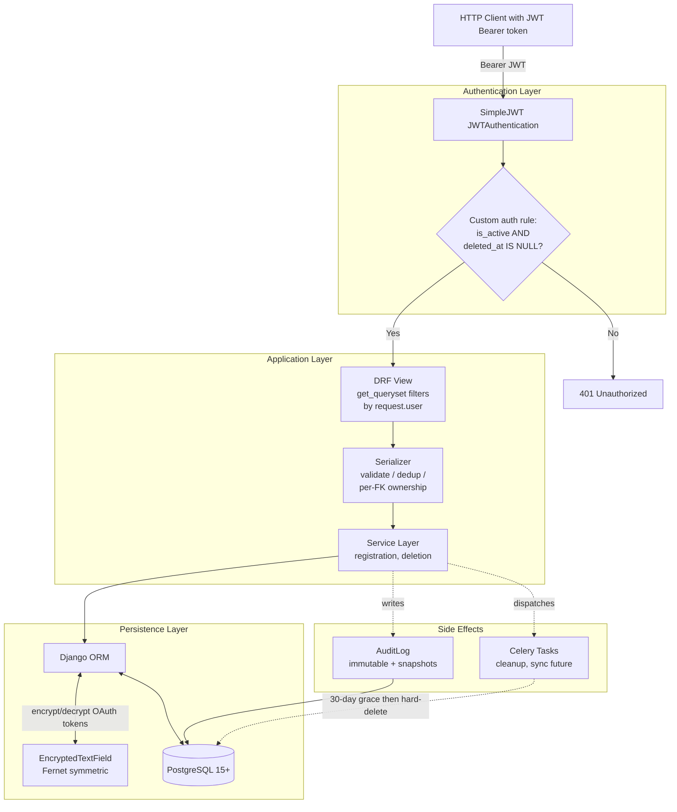

# Aurora

A multi-source athletic data hub with provider-aware deduplication and lactate-driven training analysis.


---

## Why Aurora exists

I've spent fifteen years on Kazakhstan's national short-track speed skating team, which means I've spent fifteen years using every fitness platform on the market. Whoop, Garmin, Polar, Strava, Apple Health, GymAware right now. Oura, Elite HRV, TrainingPeaks, FirstBeat Sport, Zones before that. Every one of them sees a slice of my training and recovery. None of them sees the whole picture, and most of them lie to me in interesting ways.

Four pain points I've lived with:

**Data conflicts when devices overstep.** I wear Whoop 24/7 and a Garmin watch on training days. They overlap in two places. Sleep: both give me a sleep score every morning with different methodologies, and I have to pick whom to trust. Training: Garmin records the ride properly — power, pace, HR zones, cadence. Whoop on my wrist also "detects" the session and runs its own analysis with only wrist HR, no power, no pace. The result is two records of the same workout, one accurate and one half-broken, each app insisting its version is the truth. Strava sits downstream and uploads both, so the same ride shows up twice in my feed. There is no neutral referee to say "Garmin owns the workout, Whoop owns sleep — stop fighting over each other's territory."

**Heart rate lies, lactate doesn't.** A recent ride this season: 2 hours, 215W average power, in heavy heat. My heart rate sat at 167 bpm. Garmin Connect classified the session as threshold load — Zone 4. Whoop said roughly the same, around 2 hours in Zone 4, high cardiovascular stress. The lactate measurement I took during the ride read 1.7 mmol/L, which is squarely Zone 2: base aerobic work, recovery-friendly. Neither platform lets me input lactate, so neither could see that the elevated HR was driven by heat, not by intensity. The "training effect" both apps reported was wrong by an entire zone.

**Even at the elite level, the workflow is screenshots and paper notebooks.** In the lead-up to Milan 2026, my daily preparation looked like this. Wake up — screenshot my Whoop to the team doctor. Morning ice session in a Polar chest strap, coach watching live HR rink-side. Post-session: screenshot to coach plus a perceived-effort rating from 1 to 5. Evening cycling on a power-meter trainer with Garmin: another screenshot. Lactate measurements logged in my iPhone Notes while the coach wrote them by hand in a paper notebook. Three screenshots and one paper log per day, every day, for years. World-class coaches still rebuild a daily picture in Excel because no platform delivers it for them.

**AI advice without context is noise.** Generic "based on your last week" recommendations ignore the most important variable in periodized training: which phase the athlete is in. A 5-hour zone-2 ride in a base block means "good base work." The same ride in a taper week before a championship means "you just blew the race." Zero consumer platforms know the difference — and throwing a more expensive AI model at the same bad inputs doesn't fix this; it just hallucinates with more confidence.

Aurora is the backend I wish existed when I was using all of these.

---

## Vision

Aurora is positioned as a three-tier product. Each tier targets a distinct user archetype I've watched up close — the health-conscious tracker, the self-coached athlete, and the coach-led team.

| Tier | For whom | What it adds |
|---|---|---|
| **Aurora** *(free, forever)* | Health-conscious users tracking daily wellness across multiple devices | Foundation: unified view of sleep, recovery, HR, and workouts. Provider-priority dedup decides which source wins for each metric. |
| **Aurora Plus** *(low-cost monthly subscription)* | Self-coached semi-pro athletes — marathoners, triathletes, amateur cyclists, serious gym lifters | + AI training analysis<br>+ Extra physiological metrics<br>+ Athlete-managed training-phase tagging<br>+ **Lactate tracking** (log lactate alongside workouts; reclassify intensity by lactate rather than HR alone)<br>+ Manual strength-training log (exercise, weight, reps, RPE) |
| **Aurora Pro** *(premium subscription for coaches and teams)* | Coaches managing groups of athletes — pro clubs, national teams, masters programs | + **Coach ↔ Athlete dashboard** with a **traffic-light state engine** (red = overload risk, yellow = caution, green = ready to go)<br>+ Coach-managed periodization for the whole team<br>+ Group-level views and notifications<br>+ **GymAware integration** with team-account-to-athlete mapping for velocity-based strength data |

### AI strategy: precision data, not premium models

The conventional wisdom in 2025–2026 is "pay for the best LLM you can afford." Aurora bets the opposite way. A general-purpose model fed with provider-priority-resolved data, an explicit training-phase tag, the athlete's sport and lactate baseline, and the actual goal of the current block will outperform a state-of-the-art model fed raw HR streams from two contradicting devices.

The bottleneck for athletic AI advice is never model capability — it's context-window quality. Most consumer AI features in fitness apps lose because they get fed soup: contradictory HR zones from two devices, no phase awareness, no lactate baseline, no goal. Garbage in, confident garbage out.

Aurora is designed around the inverse principle: give an ordinary model the cleanest possible inputs, and it will produce analysis that's genuinely useful. A monthly review can answer concrete questions — "what did I focus on this month?", "how much did my threshold power grow?", "did I execute the taper correctly?" — because every signal it sees has been through Aurora's dedup, owner-verified, lactate-corrected pipeline.

This also keeps the unit economics sane. A flat-rate cheap model plus clean data scales to 100K users at a fraction of the cost of "premium model plus dirty data," and the output quality is materially higher.

---

## What's built in v1

This repository contains the **backend foundation** of Aurora — the authentication layer, data models, deduplication logic, and security infrastructure that everything else will sit on top of.

### Concrete capabilities

- **Authentication & accounts** — custom User model (email-based, with role choices for athlete / coach / admin), JWT auth via SimpleJWT with token rotation and blacklist on logout, self-registration endpoint, profile management API
- **Soft-delete & GDPR compliance** — `schedule_account_deletion` service flips `deleted_at` and dispatches a Celery task to scrub raw payloads; a custom JWT authentication rule rejects tokens for soft-deleted users immediately; audit log rows preserve user-id and email snapshots that survive the eventual hard-delete
- **Domain models** — `Workout`, `WorkoutRawPayload` (separated for hot-table performance), `HealthMetrics`, `LactateMeasurement`, `UserPhysioProfile` (HR / Power zones with manual or method-driven calculation), `DataSource` (with encrypted tokens), `SportType` (with parent-child hierarchy), `AuditLog` (with snapshot fields)
- **Provider-priority deduplication** — overlapping workout time windows resolved by source ranking (Garmin > Strava > manual entry); same-day health metrics elected to primary by health-domain ranking (Oura / Whoop > Garmin for sleep)
- **Centralized authorization boundary** — `workouts/permissions.py` with `can_view` / `can_modify` predicates, fully tested, designed for v2 wiring alongside team workflows
- **Field-level encryption** — Fernet-encrypted OAuth token storage with non-deterministic ciphertext and fail-loud decryption on corruption
- **58 tests, 88% coverage** — core security paths (auth, IDOR protection, soft-delete, encryption, audit log) at 90–100%; intentional gaps documented in `TECH_DEBT.md`

### What's deliberately NOT built yet

To keep scope honest, here's what this repository does **not** contain. The architecture is designed to absorb each of these without schema rewrites — the work simply hasn't been done.

- **Live OAuth sync flows** — the `DataSource` model with encrypted token storage exists, but the OAuth-redirect / token-refresh flow per provider (Strava, Garmin Connect, GymAware Cloud) is Phase 2 work.
- **Celery workers in production mode** — Celery tasks are defined and unit-testable, but no broker is configured for the v1 demo. Local development uses synchronous calls or mocks.
- **Workout / HealthMetrics / LactateMeasurement HTTP endpoints** — the data models, serializers (with full validation and ownership protection), and dedup logic are ready. The HTTP view layer for these resources lands alongside OAuth sync.
- **Coach features** — the Pro tier (Coach Dashboard, traffic-light engine, team views, team-account-to-athlete mapping for GymAware) is intentionally deferred. The data model is designed to accept it without restructuring.
- **AI analysis layer** — described in the Vision section above. v1 ships the clean-data infrastructure; the AI advisor is built on top of it in Phase 2.
- **Frontend** — this repository is backend-only. Frontend / mobile clients are planned but out of scope here.

This split is intentional. v1 is the **load-bearing foundation**: every architectural decision in this repository is informed by the v2 / v3 features it will eventually support.

---


## Tech Stack

| Layer | Choice | Notes |
|---|---|---|
| Language | Python 3.14 | |
| Web framework | Django 6.0 + DRF 3.17 | |
| Database | PostgreSQL 15+ | Required for partial unique constraints with `nulls_distinct=False` and `select_for_update(of=...)` on nullable-FK joins |
| Authentication | SimpleJWT 5.5 | Token rotation, blacklist on logout, custom soft-delete rejection rule |
| Async tasks | Celery 5.6 | Soft-delete payload cleanup; OAuth sync flows in Phase 2 |
| Encryption | `cryptography` (Fernet) | Symmetric encryption for stored OAuth tokens (non-deterministic ciphertext) |
| Testing | pytest + pytest-django + pytest-cov | 58 tests, 88% coverage |

---

## Quick Start

### Prerequisites

- Python 3.14
- PostgreSQL 15 or newer running locally on `127.0.0.1:5432`
- A POSIX-like shell (Linux / macOS / WSL)

### 1. Clone and install

```bash
git clone https://github.com/<your-username>/aurora-backend.git
cd aurora-backend

python3.14 -m venv venv
source venv/bin/activate
pip install -r requirements.txt
```

### 2. Configure environment

Copy the template:

```bash
cp .env.example .env
```

Generate a Django secret key:

```bash
python -c "from django.core.management.utils import get_random_secret_key; print(get_random_secret_key())"
```

Generate a Fernet key for OAuth token encryption:

```bash
python -c "from cryptography.fernet import Fernet; print(Fernet.generate_key().decode())"
```

Paste both into `.env`. Fill in the PostgreSQL connection details.

### 3. Create the database

```bash
createdb aurora
# Or via psql:
# psql -U postgres -c "CREATE DATABASE aurora;"
```

### 4. Run migrations

```bash
python manage.py migrate
```

### 5. (Optional) Create a superuser for the Django admin

```bash
python manage.py createsuperuser
```

### 6. Run the development server

```bash
python manage.py runserver
```

The API is now available at `http://127.0.0.1:8000/`. The Django admin is at `http://127.0.0.1:8000/admin/`.

### 7. Run the test suite

```bash
pytest                                      # All tests
pytest -v                                   # Verbose output
pytest --cov --cov-report=term-missing      # With coverage breakdown
```

Expected: **58 passed**, ~88% coverage.

---


## Architecture Highlights

A handful of design decisions in this codebase that I expect a senior reviewer to ask about. Each one is implemented today and pinned by tests.

### 1. Provider-priority deduplication

Two devices recording the same event is the rule, not the exception. A Garmin watch and a Whoop strap both register a morning ride. An Oura ring and a Garmin both score sleep. Naively merging produces duplicates and contradictions.

Aurora resolves this by **domain-aware source ranking**, encoded in two priority maps:
*   `WORKOUT_SOURCE_PRIORITY`: Garmin > Polar > Wahoo > Strava > Apple Health > Whoop > Oura > manual.
*   `HEALTH_SOURCE_PRIORITY`: Oura > Whoop > Apple Health > Garmin > Polar > manual.

On every insert, the service layer opens a row-level lock via `select_for_update(of=('self',))` on candidate records within a 5-minute sync window. It computes an `effective_end` (handling records without an explicit end time via `Coalesce(end_time, date + duration)`) and elects the highest-priority record as primary. Losing rows are demoted to non-primary with a `duplicate_of` foreign key back to the winner. 

A database-level `CheckConstraint` ensures that no row can be marked as primary while simultaneously holding a `duplicate_of` link—preventing corrupt or partial data states physically at the DB level. Race losers fail loudly via a unique constraint on `(source, external_id)`, which handles concurrent webhook retries gracefully.

### 2. Lactate as a first-class signal

Most platforms treat lactate as a free-form note in a workout description, or omit it entirely. Aurora gives lactate measurements their own dedicated `LactateMeasurement` model with a foreign key back to the `Workout`. The `measured_at` timestamp is validated to be no earlier than the workout start (allowing for post-workout recovery samples), and the `mmol` value is strictly decimal-validated to the human physiological range (0.1–30.0 mmol/L).

This architecture provides intentional forward-compatibility. Continuous lactate monitoring (CLM) and sweat-patch sensors are rapidly emerging on the market. When they become mainstream, Aurora will require **only a new sync ingestion source**, not a database schema rewrite: the data model already natively supports multiple measurements per workout and source-priority weighting via the core engine.

### 3. Soft-delete with GDPR-compliant token rejection

Account deletion is a two-phase process, serving as a textbook example of why a simple "soft-delete" flag is insufficient under GDPR's right-to-erasure:
1.  **Phase 1 (Immediate, Atomic):** `schedule_account_deletion()` sets `User.deleted_at = now`, flips `is_active = False`, writes an identity snapshot to the `AuditLog`, and dispatches a cleanup task. All operations run inside a single `transaction.atomic()` block.
2.  **Phase 2 (Asynchronous):** A Celery task scrubs heavy raw data payloads in chunks, followed by a final hard-delete after a 30-day grace period. The Celery dispatch is intentionally placed **outside** the atomic block transaction commit to prevent classic race conditions where a worker picks up the task before the DB commit lands.

To secure this, JWT authentication uses a **custom user authentication rule** (`config/rules.py`) that rejects tokens for soft-deleted users immediately. Existing access tokens stop working the moment `deleted_at` is flagged, without waiting for the 15-minute JWT expiry window, while refresh tokens are instantly blacklisted.

### 4. Audit trail that survives the user it audits

The `AuditLog` model links to the `User` via an `on_delete=SET_NULL` relationship. When a user is permanently deleted, the foreign key becomes NULL, but two snapshot fields—`user_id_snapshot` and `user_email_snapshot`—are automatically populated on creation to preserve historical identity for compliance logs.

The audit trail is protected by two strict rules:
*   **Immutable Entries:** The `save()` method raises a `PermissionError` if the row is being updated (`self._state.adding is False`). Once written, logs cannot be modified or falsified.
*   **Data Leakage Guard:** The `extra_info` JSON field is passed through a recursive key sanitizer before writing. If forbidden keys like `password`, `token`, or `secret` are discovered, validation fails loudly, making it impossible to accidentally use audit logs as a side-channel for credential leaks.

### 5. OAuth tokens encrypted at the field level

`DataSource` stores OAuth credentials for external integrations, which are treated with high privacy sensitivity. Aurora uses a custom `EncryptedTextField` subclass that seamlessly:
*   Encrypts plaintext values on `get_prep_value()` before SQL execution.
*   Decrypts values on `from_db_value()` after fetching from the database.
*   Applies Fernet symmetric cryptography with a random IV ensuring **non-deterministic ciphertext**. Encrypting the same token twice yields entirely different bytes, preventing attackers from correlating matching tokens across accounts via raw DB dumps.
*   Fails loud with an `InvalidToken` exception if corruption or key mismatch occurs, preventing stale or broken credentials from degrading silently.

### 6. IDOR protection returns 404, not 403

When a user attempts to access or modify another athlete's private resource (workouts, profiles, tokens), Aurora responds with a **404 Not Found** instead of a 403 Forbidden. 

A 403 status code implicitly leaks resource existence, allowing malicious actors to map valid database IDs via brute-force enumeration. Narrowing the queryset down via `get_queryset().filter(user=self.request.user)` forces Django REST Framework to raise a clean 404 error, making unauthorized access requests completely indistinguishable from non-existent endpoints.

### 7. Authorization boundary — designed for v2, tested today

The `workouts/permissions.py` module defines core predicates (`can_view_athlete_data`, `can_modify_athlete_data`, etc.) designed to act as the centralized authorization boundary. It models an asymmetric security rule where administrative staff can audit and view data, but cannot write to or mutate an athlete's metrics outside of designated, audited admin actions.

While v1 views rely on strict object filtering directly, this permission matrix is completely separated and **fully unit-tested at 100% coverage today**. All truth tables and combinations of authentication, ownership, and staff roles are validated in isolation. This introduces a clean architecture seam, ensuring that wiring in multi-user coach access grants in Phase 2 requires a predictable refactor without modifying core business logic.

---

## Architecture Diagram

The request lifecycle in v1 — from HTTP request to persistence, with the security and audit hooks that distinguish Aurora's flow from a stock Django app.



A few things worth pointing out about this flow:

- **The custom auth rule is not optional middleware** — it's wired into SimpleJWT itself via `SIMPLE_JWT['USER_AUTHENTICATION_RULE']`. Soft-deleted users fail authentication at the framework layer, not at the view layer.
- **Solid arrows = synchronous request path.** Dotted arrows = side effects that fire from inside services (audit log writes, Celery dispatches). The split keeps the hot path obvious.
- **`Models <-->` is bidirectional with Fernet** — encrypt before INSERT, decrypt after SELECT, transparently. The DB never sees plaintext for `DataSource.access_token` / `refresh_token`.
- **Celery's dotted arrow back to the DB** represents the eventual hard-delete after the 30-day grace period — the right side of the GDPR compliance equation, asynchronous and idempotent.

---

## Testing

58 tests, 88% overall coverage. Hot paths — authentication, IDOR protection, soft-delete, encryption, audit log — sit at **90–100%**, which is where security regressions matter most.

### Coverage by module (security-critical first)

| Module | Coverage | What the tests pin |
|---|---|---|
| `users/views.py` | 100% | Profile API retrieve / update flows |
| `users/services/registration.py` | 100% | Atomic user + profile creation; signal-safe path |
| `users/services/account_deletion.py` | 100% | Soft-delete + Celery dispatch outside atomic + audit log |
| `workouts/permissions.py` | 100% | Authorization predicate truth tables; fail-closed defaults |
| `workouts/views.py` | 100% | `UserPhysioProfile` CRUD with IDOR-safe `get_queryset` |
| `workouts/crypto.py` | 93% | Fernet round-trip, non-deterministic ciphertext, fail-loud corruption, config errors |
| `users/serializers.py` | 90% | Validation rules, age constraints, partial-update plumbing |
| `workouts/serializers.py` | 85% | Provider-priority dedup, per-FK ownership, race-safe primary election |
| `workouts/models.py` | 81% | Constraints, custom `save()` guards, audit-log immutability |
| `users/models.py` | 71% | User manager, soft-delete query path |
| `workouts/sanitize.py` | 67% | Forbidden-key recursive scan |
| `workouts/tasks.py` | 41% | Module-level only — Celery broker integration deferred to Phase 2 |
| `workouts/mixins.py` | 36% | `UserOwnedMixin` — full exercise via real views deferred to Phase 2 |
| **Total** | **88%** | |

### What's actually tested

- **Authentication & soft-delete** (`users/tests/test_auth.py`, `test_register.py`) — login, refresh rotation, blacklist on logout, soft-deleted user gets 401, inactive user gets 401, full truth table for the custom auth rule.

- **Deduplication race-safety** (`workouts/tests/test_deduplication.py`) — higher-priority workout wins retroactively against an existing lower-priority record; incoming lower-priority becomes a duplicate immediately; same-day health metric election by source priority.

- **IDOR / cross-user access** (`workouts/tests/test_idor.py`) — GET list returns only own profiles; GET / PATCH / DELETE on foreign profile returns **404 (not 403)**; serializer rejects foreign-user FK in `source` / `user_physio_profile` / `duplicate_of` fields; the create endpoint ignores `user` field in request body (anti-ownership-forging).

- **Authorization truth tables** (`workouts/tests/test_permissions.py`) — predicates × inputs combinations covering: staff bypass for view, staff blocked for modify, anonymous user fail-closed, object without `.user` attribute fail-closed.

- **Encryption layer** (`workouts/tests/test_crypto.py`) — round-trip preservation, non-determinism via random IV, decrypt raises on corruption, missing `FERNET_KEY` → `ImproperlyConfigured`, malformed `FERNET_KEY` → `ImproperlyConfigured`. The suite injects a fresh per-test Fernet key via an `autouse` fixture to keep tests hermetic (no dependency on the developer's local `.env`).

- **GDPR account deletion** (`users/tests/test_account_deletion.py`) — `schedule_account_deletion` marks the soft-delete fields; writes an audit log with snapshot fields populated; dispatches the Celery task exactly once with the correct user id; propagates IP and User-Agent into the audit row.

### Honest gaps

- **Celery workers in production mode** — tasks are mocked in unit tests via `unittest.mock.patch`. Integration with a real broker (Redis / RabbitMQ) lands in Phase 2 alongside the OAuth sync flow.
- **Workout / HealthMetrics / LactateMeasurement HTTP endpoints** — not built in v1 (see *What's built* above). Serializer-level coverage is already 85%; view-level tests land alongside those views.
- **`UserOwnedMixin` and `sanitize_payload`** — exercised only indirectly through audit-log write paths in the current suite. Direct unit tests will land when the sync flow puts them under real provider data.

### Running the suite

```bash
pytest                                         # All 58 tests
pytest -v                                      # Verbose
pytest --cov --cov-report=term-missing         # Full coverage breakdown
pytest workouts/tests/test_idor.py -v          # Single file
pytest -k "soft_delete"                        # By keyword pattern
```

---

## Roadmap

The planned progression beyond v1. Timelines are deliberately not committed — Aurora is a portfolio project today, and milestone ordering depends on which integrations get prioritized first. The architecture in this repository is designed to support all of the following without schema rewrites.

### Phase 2 — Sync, endpoints, and first AI

The next iteration adds live data flowing in from providers and the first AI analysis layer on top of the clean-data foundation.

- **OAuth and token-based sync flows** — Strava (OAuth), Garmin Connect (OAuth), GymAware Cloud (API token + Account ID). Each provider gets its own sync task with provider-specific payload normalization, all funneling into the existing `WorkoutRawPayload` table with `payload_sha256` idempotency.
- **Celery broker in production mode** — Redis or RabbitMQ wired in; tasks dispatched from `schedule_account_deletion` and from periodic sync schedules; Flower dashboard for observability.
- **Workout / HealthMetrics / LactateMeasurement HTTP endpoints** — full DRF ViewSets with filtering, pagination, and the same per-FK ownership / IDOR-404 protection patterns established in v1.
- **Athlete-managed training-phase tagging** — base / build / peak / taper attached to date ranges per user-sport combination. The AI advisor reads this as primary context.
- **AI advisor MVP** — monthly and weekly reviews. Answers concrete questions: *"what did I focus on this month?"*, *"how much did my threshold power grow?"*, *"did I execute the taper correctly?"*. Uses the cheap-model + clean-data strategy described in the Vision section.

### Phase 3 — Coach features and Pro tier

The Pro tier turns Aurora from a personal data hub into a coach-athlete platform.

- **`CoachAccessGrant` model** — explicit, audited grants from athlete to coach. This is the model that drives `workouts/permissions.py` from designed-but-not-wired to fully active. Every coach-side data view is logged via `AuditLog` with the `athlete_data_view` action.
- **Coach Dashboard** — team-level view of every athlete's state, with the **traffic-light state engine** (red = overload risk, yellow = caution, green = ready to go) computed from sleep + recovery + lactate + training load + phase context.
- **GymAware integration with team-account-to-athlete mapping** — one team API token, mapped via the coach's UI to individual Aurora athletes. Sessions route correctly to each athlete's profile via the `CoachAccessGrant` relationship.
- **Coach-managed periodization** — the coach sets the phase for the whole team or specific blocks; the AI advisor uses coach-set phases instead of athlete-set ones.
- **Group-level views and notifications** — daily team summary, athletes flagged by the traffic-light engine, lactate-test scheduling.

### Phase 4 — Hardware integrations and advanced AI

The longer-term horizon — partly waiting on hardware maturity, partly on the AI advisor to mature on top of richer data.

- **Continuous glucose monitor integration** — Dexcom and Abbott Libre via their respective APIs and aggregators. Glucose joins lactate as a metabolic signal in the AI context window.
- **Continuous lactate monitor integration** — when commercially available (sweat-patch and optical sensors from several EU and US startups, 2027–2030 horizon). Aurora's `LactateMeasurement` schema already supports high-frequency inserts; the new sync source plugs into the existing priority engine without schema changes.
- **Strength-training schema** — dedicated `StrengthSession` and `StrengthSet` models for velocity-based training data (mean velocity, peak velocity, power per rep, per-set RPE). Bridges with the existing GymAware integration on the data side.
- **AI advisor v2** — year-over-year comparisons, periodization quality scoring, predictive overtraining detection. Built on top of the v1 advisor and the now-richer dataset.

---

## About the author

**Mersaid Zhaxybayev**, Kazakhstan.

*Trained, lived, and competed across four continents.*

Fifteen years on the Kazakhstan national short-track speed skating team. Selected results:

- **6th place** — 2018 Olympic Winter Games, PyeongChang
- **2× World Cup bronze** — Montreal 2023, Milan 2025
- **2025 Asian Winter Games** — gold and silver (across two disciplines)
- **2019 Universiade** — bronze
- Multi-time Kazakhstan national champion

I'm transitioning from professional sport into software engineering, self-taught through Coursera (Meta Backend Developer certificate) and late evenings between training blocks. Aurora is both my portfolio project and the platform I would have wanted as an athlete for the last decade and a half — built from inside the problem rather than around it.

This is my first portfolio-scale backend. Every architectural decision in this repository is informed by fifteen years of being on the user side of platforms that got it wrong. That tradeoff — deep domain knowledge from one direction, an engineering learning curve from the other — is what I bring to a backend team.

---

**Reach me:** mersaidz.dev@gmail.com
**Code:** [github.com/mersaidz/aurora-backend](https://github.com/mersaidz/aurora-backend)  
**LinkedIn:** *launching soon — link will be added here*

---

## License

Aurora is **proprietary software**. All rights reserved by Mersaid Zhaxybayev.

This repository is published on GitHub for portfolio review purposes. The code may be read, cloned, and run locally for evaluation, but it may not be used, modified, or incorporated into other projects without explicit written permission.

For licensing inquiries or collaboration, please see the contact information in *About the author* above.

See [`LICENSE`](./LICENSE) for the full terms.